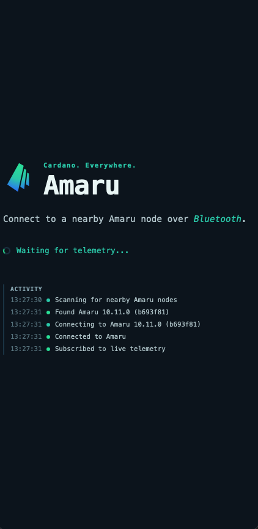
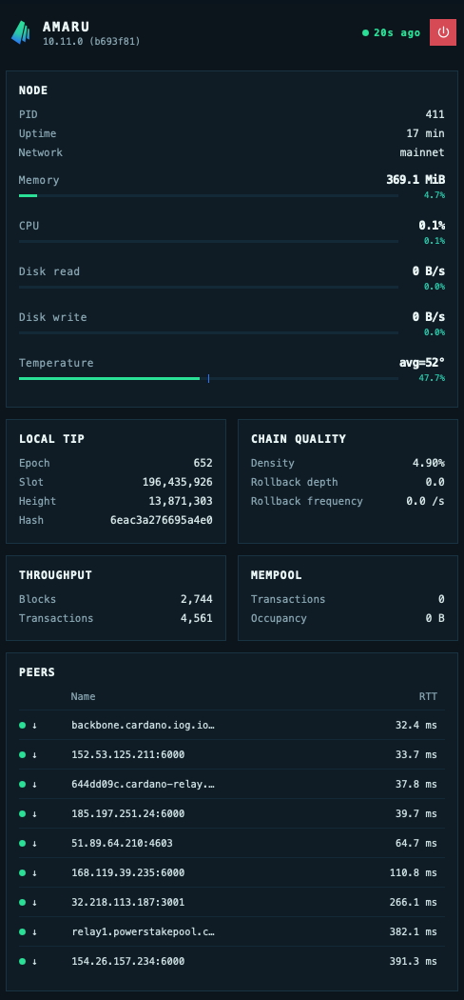

# Amaru Bluetooth Bridge

Amaru Bluetooth Bridge gives an operator a nearby, low-bandwidth view of an
Amaru node without exposing the node's database, network API, or full log
stream. It is designed for small Linux hosts such as a single-board computer
and for an iPhone or iPad acting as a local status display.

```
Amaru JSON traces -> journald -> bridge -> BLE GATT -> mobile dashboard
```

The bridge deliberately rebuilds state from Amaru's typed telemetry rather
than querying internal node state. This keeps its coupling to Amaru limited to
the public observability schema and makes missing telemetry visible instead of
silently inventing data. The projection, its peer history, and its rate
estimators are bounded in memory; no historical ledger or trace data is kept.

## Components

- [`bridge/`](bridge/) follows Amaru JSON traces from the system journal,
  maintains the bounded operator projection, samples the local host, and
  publishes a versioned CBOR snapshot over Bluetooth LE.

- [`app/`](app/) is the iOS-oriented Tauri dashboard. It receives the compact
  snapshot and renders the Amaru overview without receiving raw traces.

  |  |  |
  | ---                            | ---                            |

The bridge depends on `amaru-observability` from the Amaru Git repository for
generated telemetry names and typed field accessors. Amaru source files are
not copied into this repository.

## Compatibility and Security

The application and bridge implement one wire version at a time. Deploy a
matching pair: the application rejects snapshots from a different version
rather than attempting lossy compatibility behaviour. The Rust bridge produces
the CBOR golden vectors and the TypeScript tests decode those exact vectors to
keep the two implementations aligned.

BLE notifications are unauthenticated and unencrypted with the BlueZ local
GATT API used here. Treat the telemetry as trusted local-network data. The
optional power-off characteristic is also intentionally unauthenticated and
lets any nearby client issue its one fixed shutdown command; enable it only
where that denial-of-service risk is acceptable.

## Development

The bridge uses the Rust toolchain and Clippy configuration at this repository
root:

```bash
cargo test --manifest-path bridge/Cargo.toml
cargo clippy --manifest-path bridge/Cargo.toml --all-targets -- -D warnings
```

The application requires Node.js and Xcode for iOS development:

```bash
cd app
npm install
npm test
npm run build
npm run tauri ios dev "Your iPhone Name"
```

See the component READMEs for installation, operation, and mobile setup.
